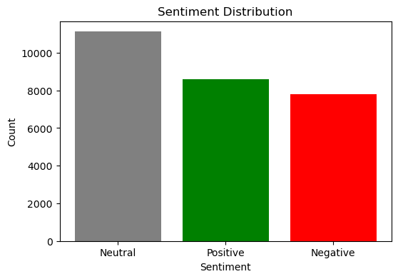
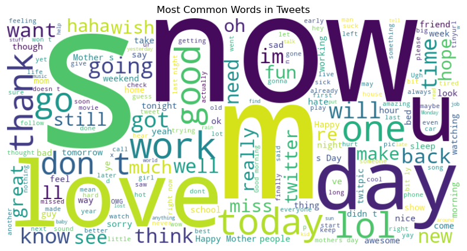

## 📊 Twitter Sentiment Analysis

Every day, millions of people express their thoughts and emotions on **Twitter**. Companies, analysts, and researchers often need to understand the **general sentiment** behind tweets—whether they are **positive, negative, or neutral**. This project leverages **Natural Language Processing (NLP) and Machine Learning** to classify tweets into sentiment categories and gain valuable insights from social media data.

Using **Python** and powerful data science libraries like **NLTK, scikit-learn, Pandas, and Matplotlib**, this project provides an end-to-end pipeline to analyze Twitter sentiment efficiently.

---

## 🚀 Key Features

Understanding the overall sentiment of tweets is crucial for businesses, policymakers, and social researchers. By cleaning and processing raw tweet data, this project builds a sentiment classification model that effectively distinguishes between **positive, neutral, and negative tweets**. 

The first step involved **data preprocessing and cleaning**, where missing values and duplicate entries were removed to ensure a high-quality dataset. Sentiment labels were converted into numerical categories to make the dataset compatible with machine learning algorithms.

```python
# Remove null values and duplicates
df = df.dropna().drop_duplicates()

# Convert sentiment labels to numerical values
df['tag_id'] = df['sentiment'].map({'neutral': 0, 'positive': 1, 'negative': 2})
```

Once the data was cleaned, **Exploratory Data Analysis (EDA)** was conducted to visualize the distribution of sentiments. This helped identify the prevalence of different sentiments in the dataset.



A **word cloud** was generated to highlight the most frequently used words in the dataset. This provided insight into common themes and topics across tweets.



To transform the text data into a format suitable for machine learning, **TF-IDF (Term Frequency-Inverse Document Frequency)** vectorization was applied. This step ensured that meaningful words contributed to the sentiment classification process.

```python
# Convert text data into numerical features
vectorizer = TfidfVectorizer(stop_words='english')
X = vectorizer.fit_transform(df['text'])
y = df['tag_id']
```

---

## 🤖 Sentiment Classification Model

For the sentiment classification task, a **Naïve Bayes classifier** was trained, a commonly used algorithm for text classification. The dataset was split into training and testing sets to evaluate model performance effectively.

```python
# Train Naïve Bayes classifier
classifier = MultinomialNB()
classifier.fit(X_train, y_train)

# Evaluate model performance
accuracy = accuracy_score(y_test, y_pred)
print(f"Accuracy: {accuracy:.2f}")
print(classification_report(y_test, y_pred))
```

The final model achieved an accuracy of **62%**, indicating that while the model effectively distinguishes between sentiment classes, there is room for improvement. The precision and recall values highlight how well the model correctly identifies different sentiment categories. 

```
Accuracy: 0.62
              precision    recall  f1-score   support

           0       0.54      0.81      0.65      2236
           1       0.73      0.58      0.64      1688
           2       0.76      0.41      0.53      1572

    accuracy                           0.62      5496
   macro avg       0.68      0.60      0.61      5496
weighted avg       0.66      0.62      0.61      5496
```

From the classification report, the **neutral class (0)** had the highest recall (81%), meaning the model correctly identified most neutral tweets but struggled with false positives in other categories. The **positive class (1)** had a balanced precision-recall tradeoff, while the **negative class (2)** had a lower recall, suggesting it was harder for the model to differentiate negative tweets from others. Improving these results would require techniques like **fine-tuning vectorization parameters, incorporating deep learning models, or expanding the dataset.**

---

## 📌 Future Work

While this project successfully implements sentiment analysis, there are several areas for potential enhancement. Improving classification performance could involve experimenting with **deep learning models like LSTMs or BERT**, which can capture context more effectively than traditional ML models. Expanding the dataset and incorporating **real-time Twitter data** would also provide more robust insights. Additionally, refining **feature extraction techniques**, such as **word embeddings (Word2Vec, FastText)**, may improve sentiment classification accuracy. 

Another possible improvement is integrating the model into a **live dashboard or web application**, allowing users to analyze sentiment trends dynamically. This would be particularly useful for businesses tracking customer sentiment in real time or researchers analyzing public opinion on various topics.

---

## 🛠 Tech Stack

This project was built using a variety of **data science and machine learning tools**:

- **Python** for data processing and model training
- **Pandas & NumPy** for handling and analyzing datasets
- **NLTK** for text processing and stopword removal
- **Matplotlib & WordCloud** for visualizations
- **scikit-learn** for machine learning model development

---

## 🎖️ Acknowledgments

This project was organized by the [**Davis Data Science Club**](https://github.com/Davis-Data-Science-Club) in Winter 2023. Special thanks to the club for organizing and supporting this initiative.

---